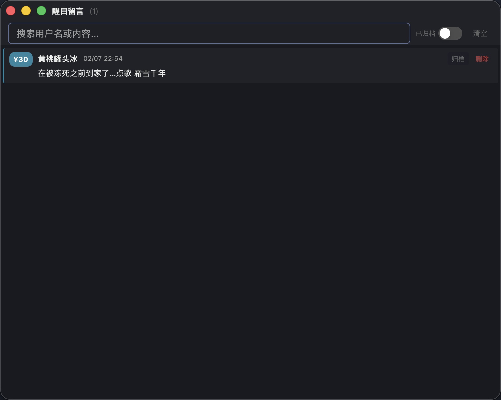
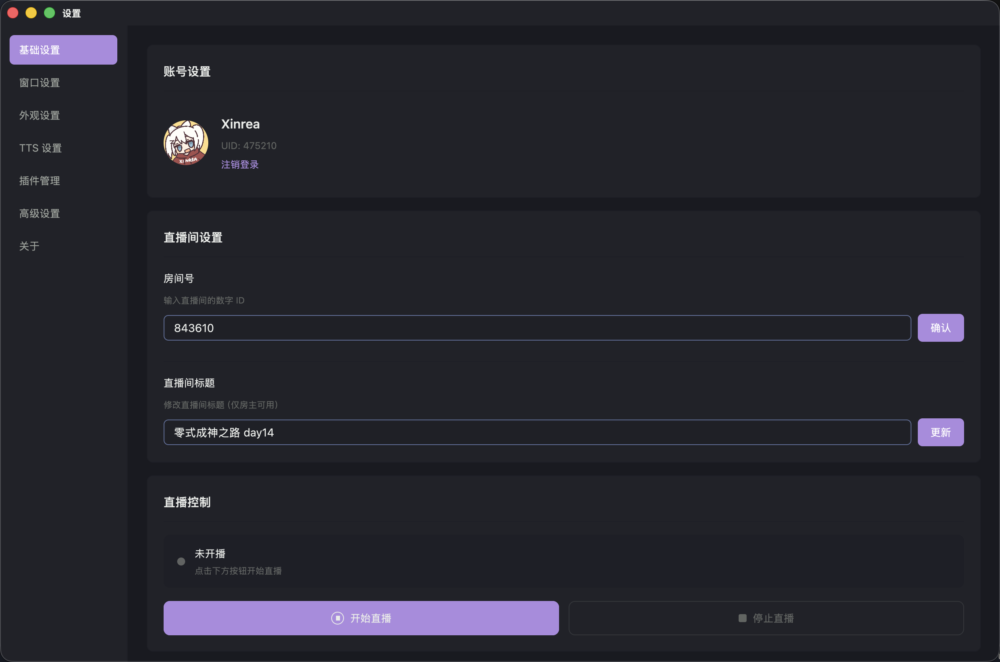

# JLiverTool

[](https://github.com/Xinrea/JLiverTool/releases)

> [!NOTE]
> 本项目自 3.0.0 版本开始，使用 Rust 重构，并使用 GPUI 框架；旧 Electron 版本请参考 [2.4.4](https://github.com/Xinrea/JLiverTool/releases/tag/2.4.4) 版本。

## 使用说明

### 1. 主界面（弹幕界面）

<table>
  <tr>
    <td>
      
    </td>
    <td>
      
    </td>
  </tr>
</table>

主界面分为三个大的部分：顶部菜单栏、弹幕列表、底部状态栏。
顶部菜单栏从左到右分别为：

- 置顶
- 礼物窗口
- 醒目留言窗口
- 统计窗口
- 观众列表窗口
- 设置窗口

底部状态栏显示当前的直播间标题，且提供了弹幕命令输入。输入普通内容后点击发送按钮即可发送弹幕。如果输入特殊命令，则会执行特殊功能。
目前支持的指令有：

- `/title <new title>` - 修改直播间标题
- `/bye` - 关闭直播

### 2. 礼物窗口


礼物窗口用于单独显示礼物和舰长记录。

### 3. 醒目留言界面



### 4. 设置界面



当登录账号与直播间号匹配时，直播间标题设置和开/关播按钮才可使用。

## 安装说明

### macOS

由于应用未经 Apple 签名，首次运行时可能提示"文件已损坏"。请在终端中执行以下命令：

```bash
xattr -cr /Applications/JLiverTool.app
```

### Arch Linux

下载 `PKGBUILD` 和 `jlivertool_*_x86_64.tar.gz` 到同一目录，然后执行：

```bash
makepkg -si
```

## 开发说明

### Run

```bash
cargo run
```

### Build

```bash
# Install cargo-packager
cargo install cargo-packager --locked

# Build release binary first
cargo build --release

# Create installers (run from project root)
cargo packager --release
```
