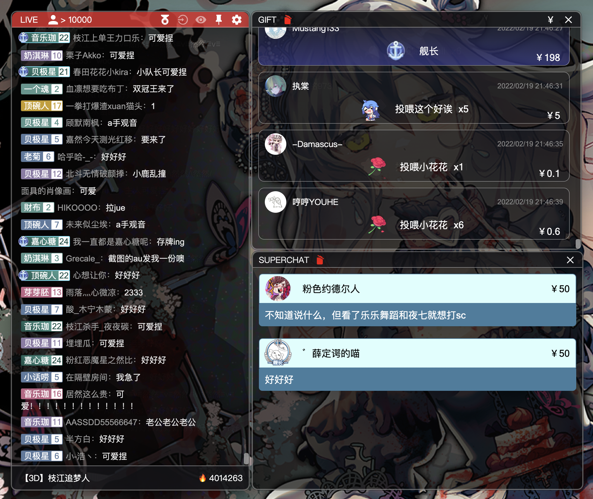
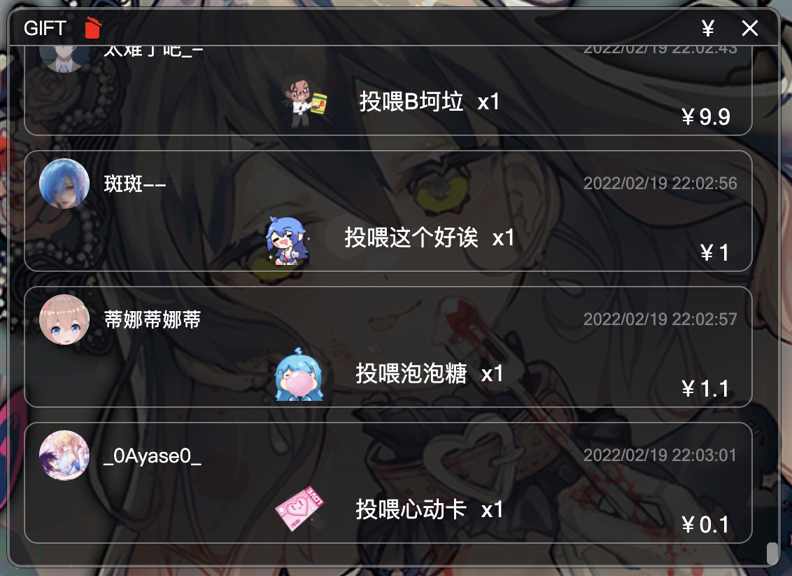
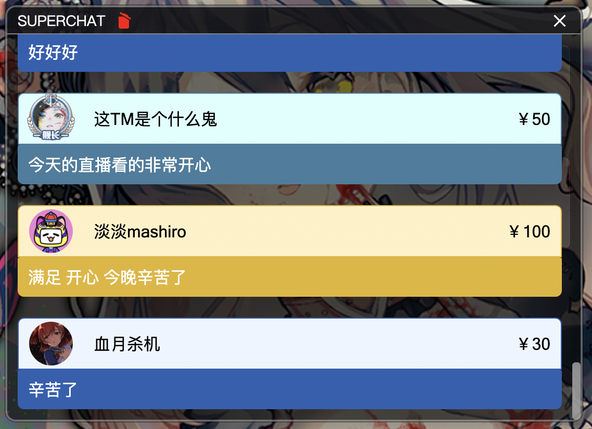

# JLiverTool

> 自 1.3.0 版本进行了重构，引入了 AlpineJS、TypeScript 以及 Webpack 便于后续维护和开发。

## 使用说明

### 1. 主界面（弹幕界面）

> 当直播间正在直播时，主界面标题栏会显示为红色
> 同接数为高能榜人数估算，仅供参考

右侧设置区域，功能从左到右分别为：

- 粉丝牌显示
- 进入房间信息显示
- 显示模式（一般模式与单页模式，类似于 [Better 弹幕姬](https://gitee.com/Schwarzer/blive-assist)）
- 窗口置顶
- 其他设置（设置透明度、字体大小、直播间，唤起其它窗口等）

### 2. 礼物界面

同样的，功能按钮位于标题栏中，从左到右分别为：

- 清空（清空所有记录）
- 免费礼物显示
- 关闭

> 所有的付费礼物均会在程序运行期间**自动保存**，程序启动时将会把保存的礼物加载入列表。
> 移除礼物记录，可以点击清空按钮，清除所有礼物记录；或者**双击**某条礼物记录，进行移除。

### 3. 醒目留言界面

同样的，功能按钮位于标题栏中，从左到右分别为：

- 清空（清空所有记录）
- 关闭

> 所有的醒目留言均会在程序运行期间**自动保存**，程序启动时将会把保存的醒目留言加载入列表。
> 移除醒目留言，可以点击清空按钮，清除所有醒目留言；或者**双击**某条醒目留言，进行移除。